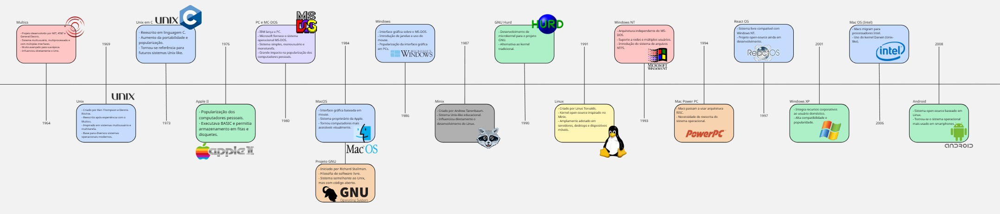

# 📘 Resumo – Aula 01: Apresentação da Disciplina e Introdução aos Sistemas Operacionais

## 👨‍🏫 Professor
Prof. Me. Deivison S. Takatu

---

## 🎯 Objetivo da Aula
A primeira aula teve como objetivo apresentar:
- A disciplina e sua contextualização;
- O plano de ensino;
- A metodologia;
- Os critérios de avaliação;
- Os principais conceitos sobre Sistemas Operacionais.

---

## 💻 Sistemas Operacionais (SO)

### Definição
Um Sistema Operacional é um software essencial responsável por gerenciar o hardware e o software do computador.

### Importância
- Atua como interface entre usuário e máquina;
- Controla recursos do sistema.

### Exemplos
- Windows  
- macOS  
- Linux  
- Android  
- iOS  

---

## 🏗️ Estrutura dos Sistemas Operacionais

### Estrutura em Camadas
- Organização hierárquica;
- Facilita a modularidade.

### Tipos de Kernel
- Monolítico;
- Modular.

### Kernel
- Núcleo do sistema;
- Possui acesso direto ao hardware;
- Gerencia recursos vitais.

### Modos de Operação
- **Modo Usuário:** programas comuns;
- **Modo Kernel:** privilégios elevados.

---

## ⏱️ Escalonamento de Processos

### Objetivos
- Eficiência;
- Justiça;
- Bom tempo de resposta.

### Algoritmos
- FIFO (First In, First Out);
- Round Robin;
- Prioridade.

### Impacto
Influencia diretamente no desempenho do sistema.

---

## 🧠 Gerenciamento de Memória

### Memória Principal
- Alocação dinâmica;
- Proteção de memória.

### Memória Virtual
- Expande a memória RAM;
- Utiliza paginação e segmentação;
- Aumenta a segurança e flexibilidade.

---

## 📂 Gerenciamento de Recursos

### Entrada e Saída (E/S)
- Controle de dispositivos periféricos.

### Sistemas de Arquivos
- Organização e acesso aos dados.

### Segurança
- Proteção contra ameaças.

### Virtualização
- Otimização de recursos;
- Maior flexibilidade.

---

## 📁 Importância do Portfólio
Manter um portfólio de projetos permite:
- Demonstrar habilidades práticas;
- Comprovar aprendizado;
- Facilitar acesso a estágios e empregos;
- Incentivar a organização e evolução profissional.

---

## 📝 Critérios de Avaliação

A nota final é calculada da seguinte forma:

(P1 × 0,25) + (P2 × 0,25) + ((PJ + AT) × 0,25)

Onde:
- P1: Prova 1  
- P2: Prova 2  
- PJ: Projeto  
- AT: Atividades  

---

## 👥 Atividades da Disciplina

- Formação de grupos (3 a 5 integrantes);
- Entregas sempre em grupo;
- Criação de um repositório no GitHub;
- Produção de resumos em Markdown;
- Elaboração de linha do tempo sobre Sistemas Operacionais;
- Uso da ferramenta Miro.

---

## ✅ Conclusão

A aula apresentou:
- A estrutura da disciplina;
- O conteúdo programático;
- As formas de avaliação;
- As atividades iniciais;
- A importância do estudo dos Sistemas Operacionais.
  
---

## Linha do Tempo dos Sistemas Operacionais

A imagem abaixo resume a evolução dos principais sistemas operacionais ao longo das décadas:

---

## 📚 Referências

- TANENBAUM, A. S.; BOS, H. Sistemas Operacionais Modernos, 2016.
- SILBERSCHATZ, A. et al. Fundamentos de Sistemas Operacionais, 2015.
- STALLINGS, W. Sistemas Operacionais: Conceitos e Projetos, 2015.
- DENARDIN, G. W.; BARRIQUELLO, C. H., 2014.
- Documentações oficiais: Red Hat e Docker.
