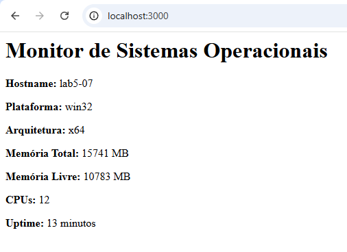
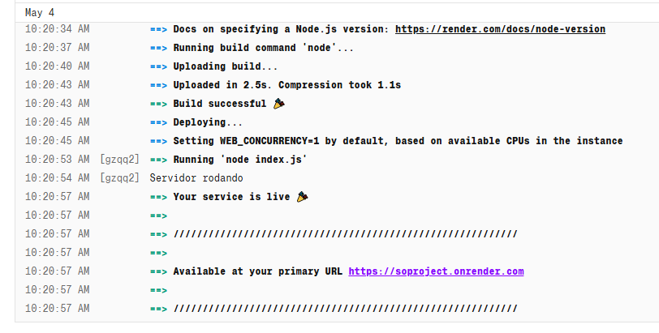
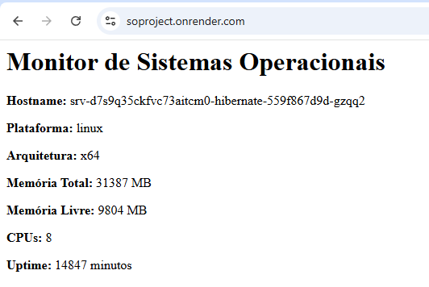

# 📘 Aula 07 — Nuvem e Sistemas Operacionais

## ☁️ 1. Conceito de Computação em Nuvem

A computação em nuvem permite acessar recursos computacionais (servidores, armazenamento e aplicações) pela internet **sob demanda**, sem a necessidade de possuir infraestrutura própria.

### Principais características (modelo NIST):

* **Autoatendimento sob demanda**: provisionamento automático de recursos
* **Acesso amplo à rede**: acesso via diferentes dispositivos
* **Pool de recursos**: compartilhamento entre múltiplos usuários
* **Elasticidade**: escalabilidade rápida conforme a demanda
* **Serviço mensurável**: cobrança baseada no uso (pay-per-use)

➡️ Transição de **CAPEX (investimento em hardware)** para **OPEX (pagamento por uso)**.

---

## 🖥️ 2. Papel do Sistema Operacional na Nuvem

O Sistema Operacional (SO) é responsável por:

* Abstrair o hardware
* Gerenciar CPU, memória e processos

### Virtualização (base da cloud)

* Permite múltiplas **máquinas virtuais (VMs)** em um único servidor
* Utiliza **hypervisor (VMM)**
* Garante isolamento e melhor aproveitamento dos recursos

---

## ⚙️ 3. Recursos e Alta Disponibilidade

### Recursos sob demanda:

* Provisionamento automático
* Escalabilidade e elasticidade

### Alta disponibilidade:

* **Zonas de disponibilidade** (datacenters separados)
* **Balanceamento de carga**
* **Replicação de dados**
* **Failover automático**

---

## 🧩 4. Modelos de Serviço

### IaaS (Infrastructure as a Service)

* Cliente gerencia SO e aplicações
* Maior controle e flexibilidade
* Exemplo: AWS EC2

### PaaS (Platform as a Service)

* Provedor gerencia infraestrutura e plataforma
* Desenvolvedor foca no código
* Exemplo: Heroku

### SaaS (Software as a Service)

* Software pronto via internet
* Usuário não gerencia nada
* Exemplo: Google Workspace

---

## 🌐 5. Modelos de Implantação

* **Nuvem Pública**: compartilhada, menor custo
* **Nuvem Privada**: dedicada, maior controle
* **Nuvem Híbrida**: combinação entre pública e privada

---

## 🏢 6. Provedores de Cloud

* AWS (Amazon Web Services)
* Microsoft Azure
* Google Cloud Platform (GCP)

---

## ⚖️ 7. Vantagens e Desafios

### ✅ Vantagens:

* Redução de custos (CAPEX → OPEX)
* Escalabilidade sob demanda
* Alta disponibilidade
* Acesso global
* Inovação acelerada

### ⚠️ Desafios:

* Vendor lock-in
* Segurança e conformidade (LGPD)
* Custos imprevisíveis
* Latência de rede
* Complexidade (multicloud/híbrido)

---

## 🔐 8. Segurança na Nuvem

Modelo de **responsabilidade compartilhada**:

* **Provedor**: segurança da infraestrutura
* **Cliente**: segurança dos dados e acessos

Inclui:

* Criptografia de dados
* Controle de acesso
* Monitoramento contínuo

---

## 📦 9. Containers e Microsserviços

### Containers:

* Empacotam aplicação + dependências
* Leves e portáteis
* Exemplo: Docker

### Microsserviços:

* Aplicações divididas em serviços independentes
* Comunicação via API
* Maior escalabilidade e resiliência

---

## 🔙 10. Backend e Web Services

* **Backend**: processa dados e regras de negócio
* **Web Services**: comunicação entre sistemas via HTTP/HTTPS
* **APIs**: integração entre diferentes sistemas

---

## 🚀 11. API REST com Express + Deploy

### Desenvolvimento:

* Node.js + Express
* Uso de CORS
* Execução com `node index.js`

### Deploy:

* Repositório no GitHub
* Plataforma Render:

  * Deploy automático
  * SSL gratuito
  * Escalabilidade

---

## 🧪 12. Atividade Prática

1. Criar aplicação com Express exibindo informações do SO:

   * Hostname
   * Plataforma
   * CPU
   * Memória
   * Tempo de atividade

2. Subir projeto no GitHub

3. Fazer deploy no Render

4. Comparar execução:

   * Local vs Nuvem

5. Relacionar com conceitos de SO:

   * Processos
   * Memória
   * CPU
   * Virtualização

6. Documentar todo o processo:

   * Instalação
   * Desenvolvimento
   * Deploy
   * Testes
   * Conclusões
  
---

# 📘 Manual de Implantação e Análise: Nuvem e Sistemas Operacionais

Este documento descreve o processo de criação, implantação e análise de uma aplicação web desenvolvida em Node.js com Express.js, nomeada `cloud-so-app`. O objetivo principal é extrair e exibir informações do sistema operacional, documentando as diferenças entre a execução em um ambiente local e em um ambiente de nuvem (Render).

---

## 🛠️ 1. Instalação das Ferramentas

Para o desenvolvimento local, foram utilizadas as seguintes ferramentas:

* **Node.js e npm:** Plataforma de execução e gerenciador de pacotes para rodar JavaScript no backend
* **Visual Studio Code (VS Code):** Editor de código-fonte utilizado no desenvolvimento
* **Git:** Sistema de controle de versão para gerenciar o código e enviá-lo ao GitHub

---

## 💻 2. Criação do Projeto e Desenvolvimento da Aplicação

A aplicação foi criada para exibir dados do sistema, como:

* Nome do host
* Plataforma
* Arquitetura
* Quantidade de CPUs
* Memória total
* Memória livre
* Tempo de atividade (uptime)

### Passos de Criação:

1. Criação do diretório `cloud-so-app` e abertura no VS Code
2. Inicialização do projeto Node.js
3. Instalação das dependências:

   ```bash
   npm install express
   npm install cors express
   ```
4. Desenvolvimento do arquivo `index.js` utilizando o módulo interno `os` do Node.js

### ▶️ Teste Local

A aplicação foi executada com:

```bash
node index.js
```

Ao acessar `http://localhost:3000`, os dados do sistema operacional da máquina local foram exibidos corretamente no navegador.



---

## ☁️ 3. Publicação no Render

Para simular o ambiente de nuvem, a aplicação foi publicada no Render, uma plataforma de hospedagem que suporta aplicações Node.js.

### Passos do Deploy:

1. Versionamento do projeto com Git e envio para um repositório no GitHub
2. Criação de um novo **Web Service** no painel do Render
3. Conexão do repositório GitHub ao Render
4. Configuração do comando de inicialização:

   ```bash
   node index.js
   ```
5. Execução do deploy e disponibilização do serviço online





https://soproject.onrender.com/

---

## 🔍 4. Testes e Comparações entre Ambientes

A seguir, uma comparação entre o ambiente local e o ambiente em nuvem:

| Informação do SO | Ambiente Local (Meu PC) | Ambiente Cloud (Render) |
| :--------------- | :---------------------- | :---------------------- |
| Hostname         | DESKTOP-XXXXX           | render-xxx-yyy          |
| Plataforma       | win32 /                 | linux                   |
| Arquitetura      | x64                     | x64                     |
| CPUs             | 8                       | 1 ou 2                  |
| Memória Total    | 16384 MB                | 512 MB (aprox.)         |
| Memória Livre    | 4096 MB                 | 128 MB (aprox.)         |

### 🧠 Análise

Observa-se que o ambiente em nuvem possui recursos mais limitados em comparação ao ambiente local. Isso ocorre devido ao modelo de compartilhamento de recursos, onde a infraestrutura é dividida entre múltiplos usuários.

---

## ⚙️ 5. Análise Técnica: Conceitos de Sistemas Operacionais

Com base na aplicação e nos dados obtidos, é possível relacionar os seguintes conceitos:

### 🔹 Processos

Ao executar `node index.js`, o sistema operacional cria um processo responsável pela execução da aplicação. No ambiente de nuvem, esse processo é executado de forma isolada.

### 🔹 Gerenciamento de Memória e CPU

No ambiente local, os dados refletem o hardware físico real. Já na nuvem, os recursos são virtualizados e limitados conforme a alocação feita pelo provedor.

### 🔹 Virtualização

Na nuvem, existe uma camada de virtualização que divide servidores físicos em múltiplas instâncias isoladas. A aplicação roda sobre um sistema operacional virtualizado, geralmente Linux.

### 🔹 Computação em Nuvem

O uso do Render caracteriza o modelo **PaaS (Plataforma como Serviço)**, onde o desenvolvedor se preocupa apenas com o código, enquanto a infraestrutura é gerenciada pela plataforma.

---

## 🧾 6. Conclusões Finais

A atividade permitiu compreender, na prática, a relação entre aplicações e o sistema operacional, especialmente no acesso a recursos de hardware.

A migração do ambiente local para a nuvem evidenciou conceitos importantes como:

* Abstração de hardware
* Virtualização
* Compartilhamento de recursos
* Escalabilidade sob demanda

Também foi possível observar como a computação em nuvem otimiza o uso de infraestrutura ao distribuir recursos entre múltiplos usuários de forma eficiente.

---