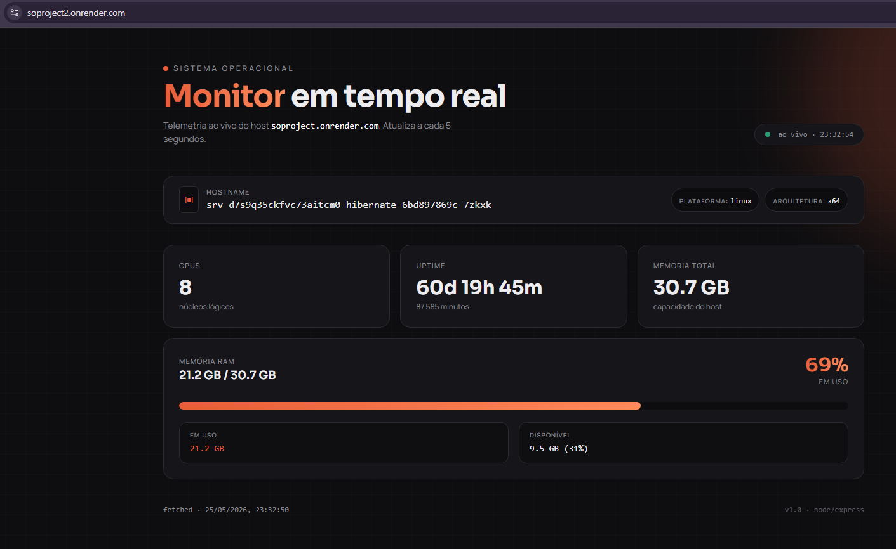
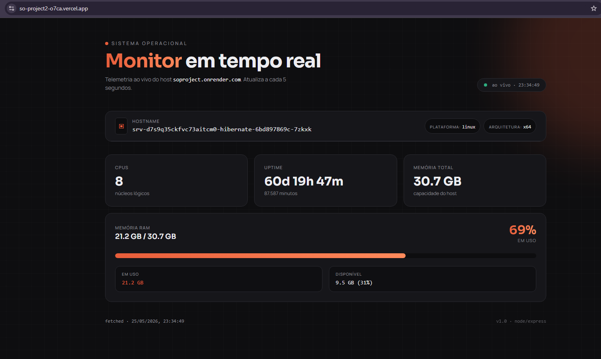

# ☁️ Aula 08 — Projeto Nuvem e Sistemas Operacionais

> Disciplina: Sistemas Operacionais  
> Professor: Deivison S. Takatu  
> Tema da Aula: Desenvolvimento de APIs REST com Node.js + Express e Deploy em Nuvem utilizando Render.

---

# 📚 Objetivo da Aula

A aula apresenta a evolução de um projeto desenvolvido anteriormente utilizando **Node.js** e **Express.js**, transformando-o em um painel de monitoramento de sistemas operacionais hospedado em nuvem.

O foco principal é compreender:

- Desenvolvimento de APIs REST;
- Hospedagem em nuvem;
- Conceitos de infraestrutura cloud;
- Monitoramento de recursos do sistema;
- Relação entre hardware, software e sistemas operacionais;
- Deploy de aplicações web.

---

# 🚀 Criação de uma API REST com Express

A primeira parte da aula demonstra como criar uma API REST simples utilizando o framework **Express.js**.

## 📌 Etapas do Projeto

### 1️⃣ Inicialização do Projeto

Criar uma pasta para o projeto e abrir no VS Code.

Exemplo:

```bash
mkdir projeto-api
cd projeto-api
```

---

### 2️⃣ Instalação do Express

O Express é um framework para Node.js que facilita a criação de servidores e APIs.

Instalação:

```bash
npm install express
```

---

### 3️⃣ Instalação do CORS

O CORS permite comunicação entre diferentes domínios no navegador.

Instalação:

```bash
npm install cors
```

## 🔍 O que é CORS?

CORS significa:

> Cross-Origin Resource Sharing

É um mecanismo de segurança usado pelos navegadores para controlar requisições entre diferentes origens.

Sem ele, aplicações frontend podem não conseguir acessar APIs externas.

---

### 4️⃣ Criação do Arquivo Principal

Criar o arquivo:

```bash
index.js
```

A aula utiliza como base um exemplo disponível no GitHub:

- Repositório exemplo:
  https://github.com/deivisontakatu/exemplo-express-so

---

### 5️⃣ Execução do Servidor

Para iniciar a aplicação:

```bash
node index.js
```

Após isso, o servidor ficará disponível localmente.

---

# ☁️ Plataforma Render

A aula também apresenta o **Render**, uma plataforma de hospedagem em nuvem.

## 📌 Características do Render

- Hospedagem moderna;
- Suporte para Node.js e Python;
- Integração com GitHub;
- Deploy automático;
- Certificado SSL gratuito;
- Escalabilidade automática;
- Interface simples;
- Ambiente profissional;
- Possui plano gratuito.

---

# 🌐 Benefícios do Deploy em Nuvem

Hospedar aplicações em nuvem oferece várias vantagens:

## ✅ Principais Benefícios

### 🔹 Deploy simplificado

A aplicação pode ser publicada rapidamente sem configurações complexas.

---

### 🔹 Atualizações automáticas

Ao atualizar o GitHub, o Render pode realizar novo deploy automaticamente.

---

### 🔹 Escalabilidade

A infraestrutura pode crescer conforme a demanda.

---

### 🔹 Monitoramento

A plataforma oferece ferramentas de monitoramento e desempenho.

---

### 🔹 Segurança

Inclui HTTPS/SSL gratuitamente.

---

# 🛠️ Processo de Deploy no Render

## 📌 Passo a Passo

### 1️⃣ Enviar Projeto para o GitHub

O projeto deve estar em um repositório público ou privado.

---

### 2️⃣ Criar Conta no Render

Acessar:

```text
https://dashboard.render.com
```

---

### 3️⃣ Criar um Web Service

Selecionar:

```text
New → Web Service
```

Depois conectar o repositório GitHub.

---

### 4️⃣ Configurar os Comandos

Build Command:

```bash
node
```

Start Command:

```bash
node index.js
```

---

### 5️⃣ Realizar o Deploy

Após o deploy, a aplicação recebe uma URL pública.

Exemplo:

```text
https://meu-projeto.onrender.com
```

---

# 🖥️ Evolução do Projeto

A proposta da aula é transformar a API em um dashboard completo de monitoramento do sistema operacional.

---

# 📊 Informações Monitoradas

O sistema deve exibir:

- Hostname;
- Plataforma;
- Arquitetura;
- Quantidade de CPUs;
- Memória RAM;
- Tempo de atividade do sistema;
- Uso médio da CPU;
- Percentual de uso de memória;
- Quantidade de arquivos do projeto;
- IP principal da máquina;
- Status geral do sistema.

---

# 📈 Dashboard Executivo

O dashboard funciona como um painel visual de monitoramento.

Ele permite:

- Visualizar desempenho da máquina;
- Entender consumo de recursos;
- Interpretar o estado atual do sistema;
- Observar comportamento do ambiente computacional.

---

# 🧠 Informações do Sistema Operacional

A aplicação também deve apresentar detalhes técnicos do sistema.

## 📌 Dados exibidos

- Nome da máquina;
- Tipo do sistema operacional;
- Versão do kernel;
- Arquitetura do processador;
- Endianness;
- Versão do Node.js.

---

# ☁️ Execução Local vs Nuvem

Um dos pontos importantes da aula é comparar ambientes.

A aplicação identifica automaticamente:

- Execução local;
- Execução em cloud;
- Variáveis de ambiente;
- Porta utilizada;
- Ambiente de produção;
- Características do servidor remoto.

---

# 🏗️ Conceitos de Sistemas Operacionais Relacionados

A atividade relaciona diversos conceitos estudados em SO:

## 🔹 Virtualização

Uso de máquinas virtuais em servidores cloud.

---

## 🔹 Gerenciamento de Recursos

Controle de CPU, memória e processos.

---

## 🔹 Infraestrutura Remota

Servidores acessados pela internet.

---

## 🔹 Serviços Sob Demanda

Recursos computacionais fornecidos dinamicamente.

---

# 📑 Atividade Proposta

A aula solicita:

## ✅ Escolher outra plataforma semelhante ao Render

Exemplos:

- Railway;
- Vercel;
- Heroku;
- Netlify;
- Fly.io.

---

## ✅ Fazer o deploy da aplicação

Hospedar o mesmo projeto na nova plataforma.

---

## ✅ Comparar as Plataformas

Criar um relatório contendo:

- Facilidade de uso;
- Velocidade de deploy;
- Recursos gratuitos;
- Interface;
- Performance;
- Estabilidade;
- Limitações.

---

# ⚙️ Proposta Avançada

A aula propõe adicionar simulações de funcionalidades típicas de sistemas operacionais.

## 📌 Exemplos

### 🔹 Simulação de memória

- Alocação;
- Liberação;
- Consumo de RAM.

---

### 🔹 Simulação de processos

- Criação de processos;
- Filas de execução;
- Gerenciamento de tarefas.

---

### 🔹 Manipulação de arquivos

- Criar arquivos;
- Ler arquivos;
- Excluir arquivos;
- Navegação em diretórios.

---

# 🎯 Objetivo Pedagógico

A proposta busca unir:

- Desenvolvimento web;
- Computação em nuvem;
- Conceitos de sistemas operacionais;
- Monitoramento de infraestrutura;
- Programação backend.

---

# 🧩 Tecnologias Utilizadas

## 🟢 Node.js

Ambiente de execução JavaScript no servidor.

---

## ⚡ Express.js

Framework backend para criação de APIs.

---

## 🌐 Render

Plataforma de hospedagem cloud.

---

## 🧱 GitHub

Controle de versão e integração contínua.

---

# 📚 Referências Bibliográficas

## 📖 Livros

- TANENBAUM — Sistemas Operacionais Modernos;
- SILBERSCHATZ — Fundamentos de Sistemas Operacionais;
- STALLINGS — Sistemas Operacionais: Conceitos e Projetos;
- DOWNEY — Think OS.

---

## 🌍 Documentações

- Docker Documentation;
- Red Hat Documentation.

---

---

# ☁️ Atividade Prática — Deploy em Cloud Computing

Após o desenvolvimento da aplicação utilizando Node.js e Express, foi realizado o deploy do sistema em plataformas de computação em nuvem, permitindo executar a aplicação em ambiente remoto de produção.

O objetivo da atividade foi compreender na prática conceitos relacionados a:

- computação em nuvem;
- hospedagem de aplicações;
- infraestrutura remota;
- virtualização;
- monitoramento de sistemas;
- deploy automatizado;
- execução de aplicações backend em ambiente Linux cloud.

---

# 🚀 Deploy no Render

O primeiro deploy foi realizado utilizando a plataforma Render, através da integração com um repositório GitHub.

## 📌 Processo realizado

1. Upload do projeto no GitHub;
2. Criação de um Web Service no Render;
3. Configuração do ambiente Node.js;
4. Definição do comando de inicialização;
5. Publicação automática da aplicação.

---

# 🖥️ Informações Obtidas no Deploy Render

Durante a execução da aplicação hospedada no Render, foi possível visualizar informações do sistema operacional em tempo real.

## 📊 Dados exibidos

- Hostname do servidor;
- Plataforma Linux;
- Arquitetura x64;
- Quantidade de CPUs;
- Uptime do sistema;
- Memória RAM total;
- Uso de memória em tempo real;
- Status do ambiente cloud.

A aplicação atualiza automaticamente os dados a cada 5 segundos, funcionando como um dashboard de monitoramento do sistema operacional.

---

# 📸 Evidência do Deploy no Render



---

# ☁️ Deploy no Vercel

Também foi realizado um deploy experimental utilizando a plataforma Vercel, conhecida principalmente pela hospedagem de aplicações frontend e projetos utilizando Next.js.

---

# 📌 Processo realizado

1. Conexão do repositório GitHub com a Vercel;
2. Detecção automática do projeto;
3. Configuração do ambiente Node.js;
4. Build automático da aplicação;
5. Publicação em ambiente cloud.

---

# 🖥️ Informações Obtidas no Deploy Vercel

A aplicação conseguiu executar parcialmente na Vercel, porém algumas funcionalidades relacionadas ao monitoramento contínuo do sistema operacional apresentaram limitações.

Isso ocorre porque a plataforma utiliza arquitetura serverless, executando funções sob demanda.

---

# 📊 Dados exibidos

- Ambiente Linux;
- Execução Node.js;
- Informações básicas do sistema;
- Inicialização da API;
- Execução parcial do monitoramento.

---

# 📸 Evidência do Deploy no Vercel




---

# 📊 Comparação Entre Render e Vercel

| Característica | Render | Vercel |
|---|---|---|
| Tipo principal de uso | Backend + APIs | Frontend + aplicações web |
| Suporte Node.js | Completo | Limitado para APIs persistentes |
| Execução contínua | Sim | Não totalmente persistente |
| Ideal para monitoramento SO | Sim | Parcial |
| Deploy automático | Sim | Sim |
| Infraestrutura | Containers Linux | Serverless |
| Uptime contínuo | Sim | Limitado |
| Melhor uso | APIs REST e microsserviços | Frontend React/Next.js |

---

# ⚠️ Limitações Encontradas na Vercel

Durante os testes, observou-se que a Vercel possui limitações para aplicações de monitoramento contínuo de sistema operacional.

Isso ocorre porque a plataforma utiliza principalmente arquitetura serverless, onde as funções são executadas sob demanda, não permanecendo ativas continuamente como no Render.

Dessa forma:

- monitoramento em tempo real fica limitado;
- processos persistentes não funcionam adequadamente;
- leitura contínua de métricas do sistema operacional é reduzida.

---

# ✅ Resultado Obtido

O Render apresentou melhor compatibilidade com a proposta da atividade, permitindo:

- execução contínua da aplicação;
- monitoramento em tempo real;
- acesso constante às métricas do sistema;
- funcionamento estável do backend Node.js.

Já a Vercel demonstrou melhor adequação para aplicações frontend e projetos focados em interfaces web estáticas ou frameworks como Next.js.

---

# 🎯 Conclusão

A atividade permitiu compreender diferenças práticas entre plataformas modernas de computação em nuvem.

O deploy realizado demonstrou conceitos importantes estudados na disciplina de Sistemas Operacionais, como:

- virtualização;
- infraestrutura remota;
- gerenciamento de recursos;
- monitoramento do sistema;
- execução de processos em ambiente Linux cloud.

Além disso, a comparação entre Render e Vercel mostrou que diferentes plataformas possuem objetivos distintos e comportamentos específicos dependendo do tipo de aplicação hospedada.